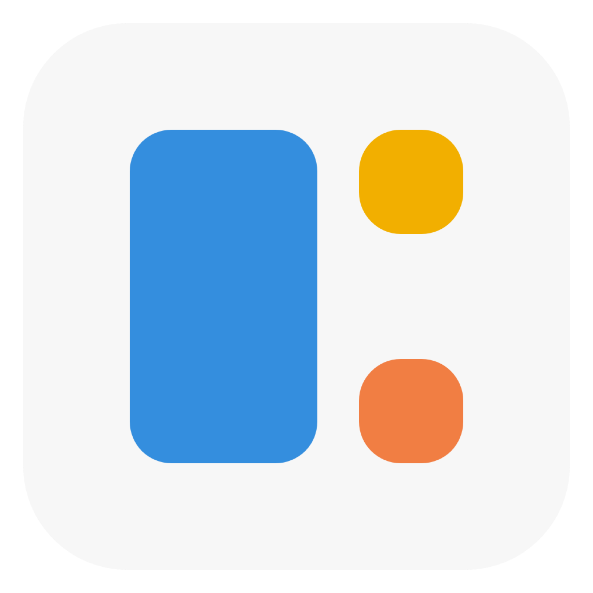
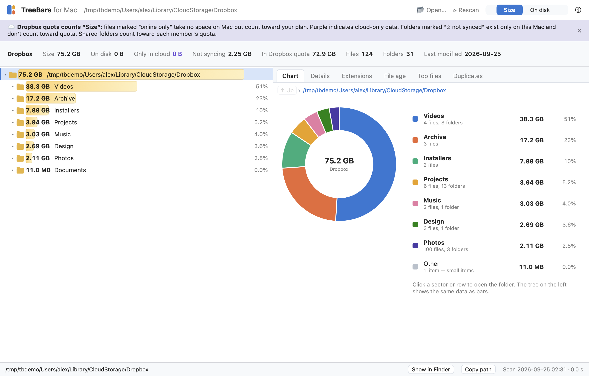
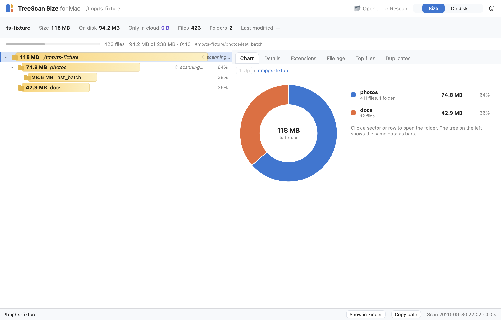
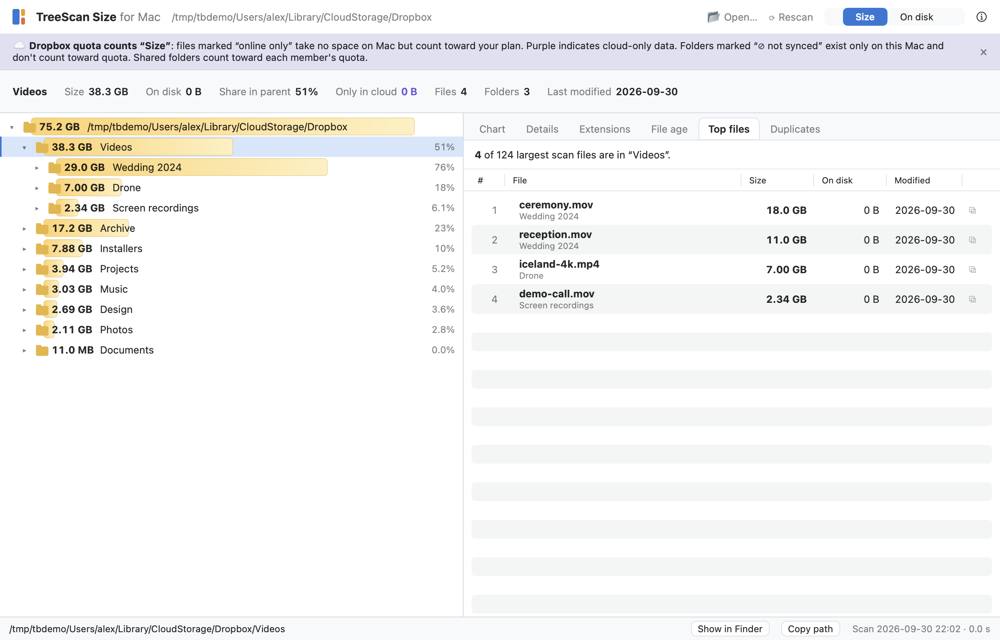
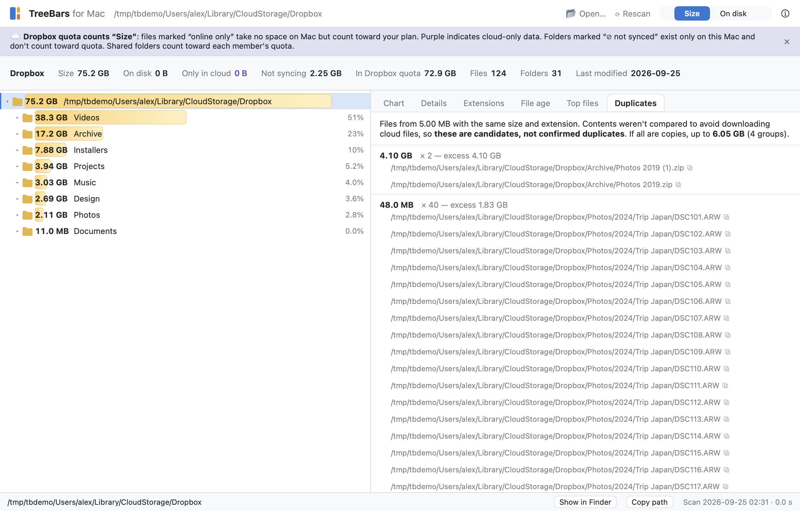
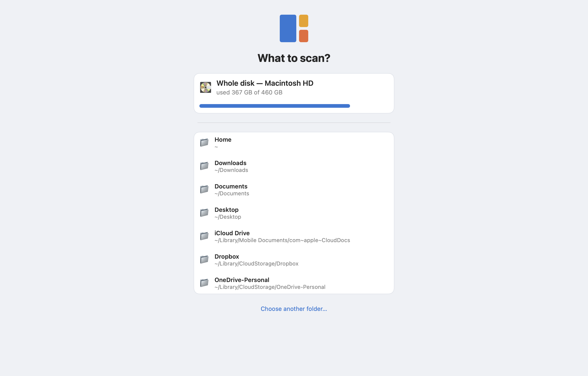
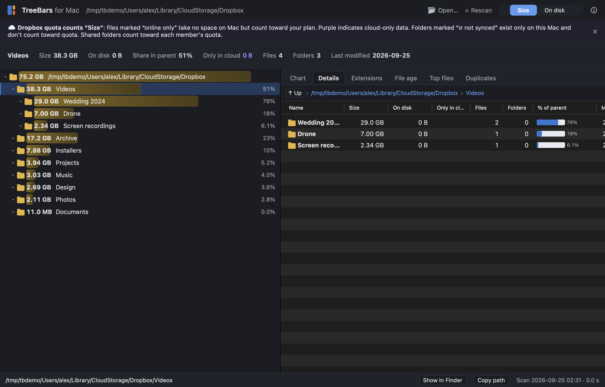

<p align="center">
  
</p>

<h1 align="center">TreeScan Size</h1>

<p align="center">
  <b>Descubre qué llena tu Mac — como un árbol de carpetas con barras de tamaño.</b><br>
  Gratis y de código abierto. Sin red, sin rastreo. Entiende Dropbox, iCloud y OneDrive.
</p>

<p align="center">
  <a href="https://github.com/gorbarov/treescan-size/releases/latest"></a>
  
  
  
  <a href="LICENSE"></a>
  
</p>

<p align="center">
  <a href="README.md">English</a> · <a href="README.ru.md">Русский</a> · <b>Español</b> · <a href="README.de.md">Deutsch</a> · <a href="README.fr.md">Français</a> · <a href="README.pt-BR.md">Português</a> · <a href="README.ko.md">한국어</a> · <a href="README.zh-CN.md">简体中文</a> · <a href="README.ja.md">日本語</a>
</p>

<p align="center">
  
</p>

---

## Por qué

El Finder no puede decirte qué carpetas se comieron tu disco. La mayoría de los analizadores de disco para Mac dibujan anillos o treemaps. **TreeScan Size muestra la vista que los usuarios de Windows conocen de TreeSize:** un árbol de carpetas simple donde cada fila tiene una barra de tamaño y su porcentaje respecto al padre. Desplázate hacia abajo — y sabrás qué limpiar.

## Destacados

|  |  |
|---|---|
| 🌳 **Árbol con barras de tamaño** | Cada carpeta muestra su tamaño y su % respecto al padre, ordenadas de mayor a menor. Teclas de flecha, clic en cualquier parte de una fila. |
| ⚡ **Escaneo en vivo** | El árbol se va llenando mientras corre el escaneo, con una barra de progreso real (porcentaje del espacio usado del disco). Sin esperar detrás de un spinner. |
| ☁️ **Compatible con la nube** | Los archivos "solo en línea" de Dropbox, iCloud y OneDrive se marcan: cuentan para tu plan de nube pero no ocupan espacio en el Mac. Marca una carpeta de Dropbox como **No sincronizar** directamente desde el menú. |
| ⚖️ **Tamaño vs En disco** | *Tamaño* es lo que pesan los archivos y lo que cuentan las cuotas de la nube. *En disco* es lo que realmente ocupan en este Mac. Un disco de Docker o de una VM puede "pesar" 460 GB y usar 39 GB — ves ambos. |
| 🔍 **Seis vistas** | Gráfico, Detalles, Extensiones, Antigüedad de archivos, Archivos más grandes, Candidatos a duplicados (encontrados sin descargar archivos de la nube). |
| 🛡️ **Seguro y privado** | Solo a la Papelera, con confirmación; las carpetas del sistema están protegidas. Sin acceso a la red, sin analíticas, sin cuentas. Consulta [PRIVACY.md](PRIVACY.md). |
| 🌍 **9 idiomas** | English, 简体中文, 日本語, 한국어, Deutsch, Español, Français, Português, Русский. Tema claro y oscuro. |

## Capturas de pantalla

| Escaneo en vivo | Archivos más grandes | Candidatos a duplicados |
|---|---|---|
|  |  |  |

| ¿Qué escanear? | Tema oscuro | Tamaño vs En disco, explicado |
|---|---|---|
|  |  |  |

## Instalación

Requiere **macOS 14 Sonoma o posterior** en **Apple Silicon**.

1. Descarga **TreeScan-Size.zip** desde [Releases](https://github.com/gorbarov/treescan-size/releases/latest), descomprímelo y mueve la app a Aplicaciones.
2. La compilación **aún no está notarizada**, así que macOS bloquea el primer inicio:
   - **macOS 15 y posteriores:** abre la app una vez, haz clic en *Listo*, luego **Ajustes del Sistema → Privacidad y seguridad → Abrir de todos modos**.
   - **macOS 14:** haz clic derecho en la app → **Abrir** → **Abrir**.
   - O en Terminal: `xattr -dr com.apple.quarantine "/Applications/TreeScan Size.app"`
3. En el primer inicio la app solicita **Acceso total al disco** — un interruptor en Ajustes del Sistema en lugar de una docena de avisos de macOS para Escritorio, Documentos, iCloud y datos de otras apps. Puedes omitirlo: las carpetas protegidas simplemente se marcan con 🔒 y no se leen.

### Compilar desde el código fuente

```bash
git clone https://github.com/gorbarov/treescan-size && cd treescan-size
scripts/make_app.sh          # Command Line Tools are enough (Swift 5.9+), no Xcode needed
open "build/TreeScan Size.app"
```

## Comparado con otras herramientas

| | TreeScan Size | DaisyDisk | GrandPerspective | OmniDiskSweeper | Disk Inventory X |
|---|---|---|---|---|---|
| Vista principal | árbol con barras de tamaño + gráfico | anillos sunburst | treemap | lista en columnas | treemap + lista |
| Precio | gratis | de pago | gratis (de pago en el App Store) | gratis | gratis |
| Código fuente | abierto, MIT | cerrado | abierto, GPL | cerrado | abierto, GPL |

Además: archivos de nube solo en línea marcados, "No sincronizar" de Dropbox desde el menú, conmutador Tamaño / En disco, árbol en vivo durante el escaneo, candidatos a duplicados sin descargar archivos de la nube.

*Basado en descripciones públicas a septiembre de 2026 — se agradecen correcciones.*

## Cómo se construyó

TreeScan Size también es un experimento. **El código lo escribió un modelo de programación barato** (DeepSeek V4 Flash) mientras Claude Opus actuaba como líder técnico: escribió la especificación, dividió el trabajo en ~25 tareas pequeñas con respuestas precalculadas, revisó cada línea riesgosa. Un script de Python y un informe HTML ([reference/](reference/)) sirvieron como implementación de referencia.

Lo que aprendimos, en resumen:
- Un modelo barato es excelente con un camino bien trazado: portar lógica desde una referencia, construir UI desde un esqueleto de código.
- Los tests en verde no bastan: una vez desactivó la protección de carpetas del sistema del menú de la Papelera mientras todos los tests pasaban — solo la revisión de código lo detectó.
- Una carpeta de prueba de 500 archivos oculta lo que muestran 2,9 millones de archivos: una pestaña tardó 9 minutos en dibujarse en un disco real. Las comprobaciones a escala real lo encontraron, un humano encontró el resto.

La historia completa — tareas, comprobaciones, lecciones, registros de ejecución — está en [docs/FINDINGS.md](docs/FINDINGS.md) y [docs/RESEARCH.md](docs/RESEARCH.md) (en ruso); los registros de ejecución están adjuntos al [release](https://github.com/gorbarov/treescan-size/releases/latest).

## Contribuir

Los informes de errores, las traducciones y las revisiones de hablantes nativos son muy bienvenidos — consulta [CONTRIBUTING.md](CONTRIBUTING.md).

## Licencia y marcas registradas

[MIT](LICENSE). TreeScan Size se inspira en TreeSize para Windows pero **no está afiliado ni respaldado por JAM Software**. TreeSize es una marca registrada de Joachim Marder e.K. (JAM Software). Dropbox, iCloud, OneDrive y macOS son marcas registradas de sus respectivos propietarios.
