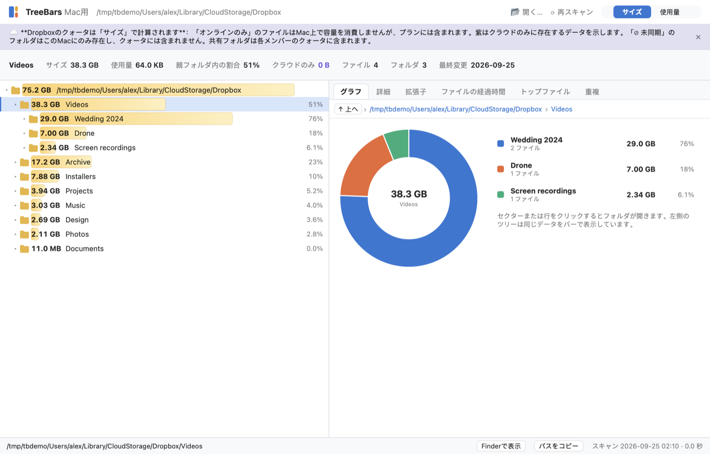

<h1 align="center">TreeScan Size</h1>

<b>Macの容量を何が使っているか、サイズバー付きのフォルダツリーで。</b> 
無料・オープンソース・通信なし。Dropbox と iCloud に対応。

<a href="README.md">English</a> · <a href="README.zh-CN.md">简体中文</a>

## なぜ作ったか

Finder では、どのフォルダがディスクを食っているのかわかりません。Mac のディスク分析アプリの多くはリング図やツリーマップです。TreeScan Size は Windows の TreeSize でおなじみの表示を採用しました。**フォルダツリーの各行にサイズのバーと、親フォルダに対する割合を表示します。** スクロールするだけで、どこを片付ければいいかがわかります。

## 機能

- **スキャン中もリアルタイム表示**：スキャン中にツリーが埋まっていき、実際の進捗バー（使用済み容量に対する割合）が表示されます。
- **サイズバー付きのフォルダツリー**：割合を表示し、サイズ順に並べます。キーボード操作に対応。
- 選択したフォルダの**グラフ**、**詳細**、**拡張子**、**ファイルの経過時間**、**大きいファイル**、**重複候補**のタブ。
- **クラウド対応。** Dropbox と iCloud の「オンラインのみ」ファイルを区別します。クラウドの容量には数えられますが、Mac の容量は使いません。Dropbox のフォルダは右クリックメニューから**同期しない**に設定できます。
- **「サイズ／使用量」の切り替え。** *サイズ*はファイル自体の大きさで、クラウドの容量はこれで計算されます。*使用量*はこの Mac で実際に使っている容量です。オンラインのみのファイルは使用量がほぼ 0。Docker や仮想マシンのディスクのようなスパースファイルは、サイズが 460 GB でも使用量が 39 GB ということがあります。
- **重複候補**：同じサイズと拡張子のファイルを、クラウドのファイルをダウンロードせずに探します。
- **安全**：削除は確認のうえゴミ箱へ移すだけ。システムフォルダは保護されています。
- **プライバシー**：通信なし、解析なし、アカウント不要。[PRIVACY.md](PRIVACY.md) を参照。
- ライト／ダークテーマ、9 言語対応。

## インストール

**macOS 14 以降**、**Apple シリコン**搭載の Mac が必要です。

1. [Releases](https://github.com/gorbarov/treescan-size/releases) から `TreeScan-Size.zip` をダウンロードして展開し、`TreeScan Size.app` をアプリケーションフォルダへ移動します。
2. 現在のビルドは**まだ公証されていない**ため、初回起動はブロックされます。
   - **macOS 15 以降**：一度開いて「完了」を押し、**システム設定 → プライバシーとセキュリティ**で**このまま開く**をクリック。
   - **macOS 14**：アプリを右クリック → **開く** → **開く**。
   - またはターミナルで：`xattr -dr com.apple.quarantine "/Applications/TreeScan Size.app"`

初回起動時に**フルディスクアクセス**を求めます。システム設定のスイッチを1つオンにするだけで、十数回の確認ダイアログが不要になります。スキップも可能で、その場合は保護されたフォルダに 🔒 が付き、読み込まれません。

ソースからのビルド：`scripts/make_app.sh`（Command Line Tools のみで可、Xcode は不要）。

## どうやって作ったか

TreeScan Size は実験でもあります。**コードを書いたのは格安のコーディングモデル DeepSeek V4 Flash** で、Claude Opus はテックリードとして仕様を書き、作業を答え付きの小さなタスクに分け、コードをレビューしました。モデルの費用は合計 約 7 ドルです。詳細は [docs/FINDINGS.md](docs/FINDINGS.md)（ロシア語）。

## コントリビュート

バグ報告、翻訳、既存の翻訳のネイティブチェックを歓迎します。[CONTRIBUTING.md](CONTRIBUTING.md) を参照。

## ライセンスと商標

[MIT](LICENSE)。TreeScan Size は Windows 版 TreeSize に着想を得ていますが、**JAM Software とは一切関係ありません**。TreeSize は Joachim Marder e.K.（JAM Software）の登録商標です。
